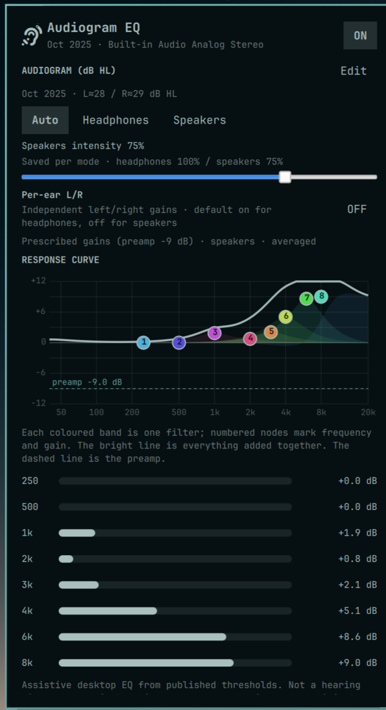
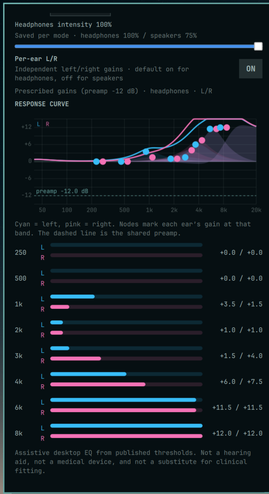
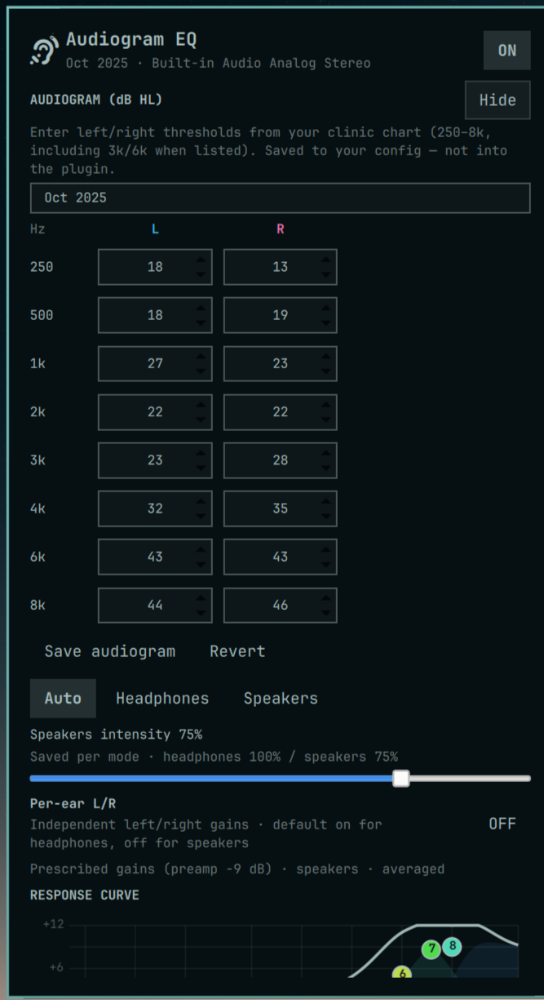
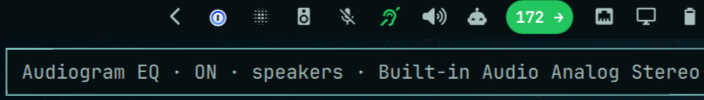

# Audiogram EQ

Listener-compensating equalizer for Omarchy. Enter clinical audiogram
thresholds and get **headphones** / **speakers** presets shaped for *your*
hearing — not a measurement of whether the laptop sounds “flat.”

This is **assistive desktop audio**, not a hearing aid or medical device.









## Install

```sh
omarchy plugin add https://github.com/Fail-Safe/omarchy-audiogram-eq.git --enable
```

Open the ear / hearing glyph on the bar, enter your audiogram, then turn
compensation **ON**. Pick **Auto**, **Headphones**, or **Speakers**.

Middle-click the bar icon to toggle ON/OFF.

## Entering your audiogram

New installs ship a blank **custom** profile (all thresholds `0` dB HL).
Enabling EQ does nothing useful until you enter a chart.

1. Open the panel → **AUDIOGRAM (dB HL)** → **Edit**
2. Fill left/right thresholds at 250 / 500 / 1k / 2k / 3k / 4k / 6k / 8k
3. **Save audiogram**

Leave unused bands at `0` if your clinic chart omits them. Saves go to
`~/.config/omarchy/audiogram-eq/profiles/` (never into the plugin tree).

## How it works

One half-gain style curve from the audiogram. Speakers and headphones share
the same mapping; only intensity (and optional per-ear L/R) differ.

```
gain = clamp(0, 12, 0.5 * max(0, threshold − 20)) × intensity
```

| Mode | Default intensity | Default per-ear L/R |
|---|---:|:---:|
| Headphones | 100% | On |
| Speakers | 50% | Off |

- **Per-ear on:** left and right thresholds drive separate dual-mono chains
  (FL → `l_*`, FR → `r_*`).
- **Per-ear off:** both ears get the averaged curve.
- **Auto:** picks headphones vs speakers from the current sink, then applies
  that mode’s saved intensity and per-ear setting.

## Bar icon colors

Default is fixed green/red for clear ON/OFF. Theme-particular users can
follow Omarchy colors instead:

```sh
omarchy bar set failsafe.audiogram-eq iconColors theme    # accent / muted
omarchy bar set failsafe.audiogram-eq iconColors status   # green / urgent (default)
```

## CLI

From the installed plugin directory (or a local checkout):

```sh
backend/agc status --json
backend/agc enable
backend/agc disable
backend/agc mode auto|headphones|speakers
backend/agc intensity 75
backend/agc per-ear on|off|toggle
backend/agc profile-save '{"label":"My audiogram","left":{"250":20,...},"right":{...}}'
backend/agc preview --json
backend/agc apply
backend/agc doctor --json
backend/agc reset
```

## Profile format

See `profiles/custom.json` (blank starter). Prefer the panel editor; you can
also drop JSON into `~/.config/omarchy/audiogram-eq/profiles/` (user files
override bundled ones with the same id).

## Coexistence

- **Speaker Calibrator** corrects the *machine*. This plugin shapes output
  for the *listener*. Stacking both can over-boost highs — try one at a
  time first.
- **ParvvOK Equalizer** is a manual six-band EQ. Prefer one EQ graph at a
  time so smart sinks do not nest awkwardly.

## Update

```sh
omarchy plugin update failsafe.audiogram-eq
```

## Remove

```sh
omarchy plugin remove failsafe.audiogram-eq --yes
backend/agc reset   # optional: clear WirePlumber fragment + local state
```

## Important safety note

**Not a medical device.** Assistive desktop EQ from published thresholds —
not a hearing aid, not a substitute for clinical fitting, and not for
treatment decisions. Follow your clinician’s guidance.

## License

MIT
